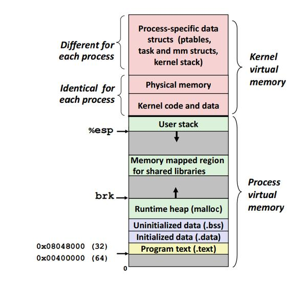
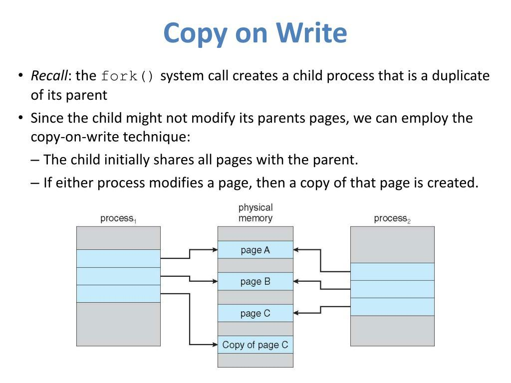
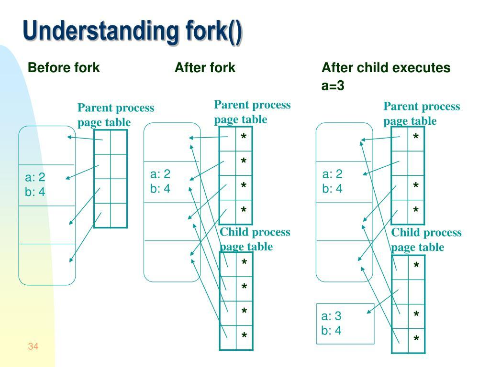
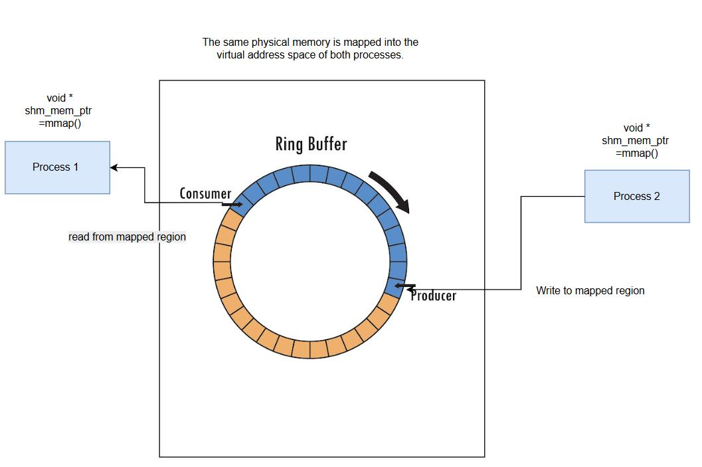
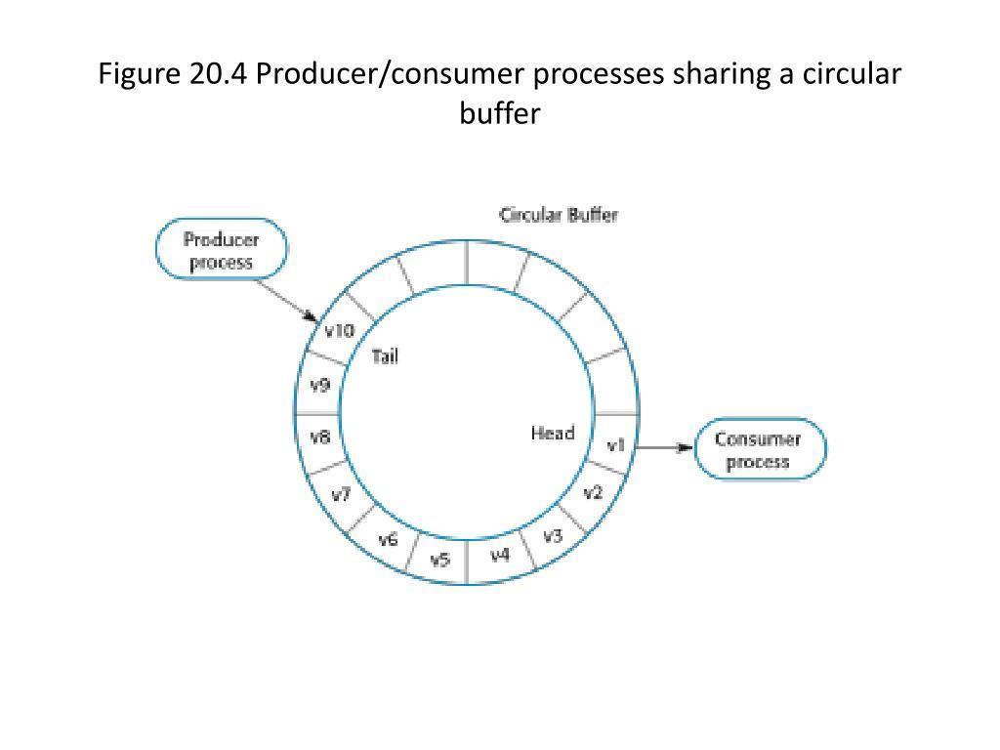

# php-memory-lab

**A hands-on laboratory for understanding PHP memory, processes, Copy-on-Write, IPC, shared memory, `mmap`, and native memory.**

`php-memory-lab` is an educational systems-programming project focused on how PHP uses memory and how PHP applications interact with operating-system primitives.

The project is designed as a practical learning laboratory: every topic is explored through small experiments, measurable results, tests, and progressively more advanced implementations.

The goal is not to build a production-ready memory manager or shared-memory framework. The goal is to understand what happens underneath PHP applications and to develop the ability to reason about memory, processes, allocation, isolation, and communication.

---

## Why this project exists

PHP is usually presented as a high-level application language.

However, modern PHP applications often depend on concepts that are much closer to operating-system and runtime internals:

- process memory;
- virtual memory;
- resident memory;
- heap allocation;
- garbage collection;
- reference counting;
- process creation;
- `fork()`;
- Copy-on-Write;
- Unix sockets;
- shared memory;
- semaphores;
- memory-mapped files;
- native allocations;
- FFI;
- long-running workers;
- memory leaks;
- fragmentation;
- process isolation.

These concepts become especially important when working with:

- PHP-FPM;
- Symfony Messenger;
- RoadRunner;
- Swoole;
- FrankenPHP workers;
- custom worker pools;
- asynchronous processing;
- high-load services;
- long-running PHP processes;
- database parallelization;
- queues and background workers.

`php-memory-lab` provides a controlled environment for studying these mechanisms without the complexity of a large production system.

---

## Learning goals

This project aims to build a practical understanding of:

1. How PHP reports memory usage.
2. The difference between PHP memory and operating-system memory.
3. The difference between virtual memory and resident memory.
4. How arrays, strings, objects, and references consume memory.
5. How PHP reference counting works.
6. How PHP garbage collection works.
7. How memory behaves in long-running processes.
8. How `fork()` creates a child process.
9. How Copy-on-Write works.
10. How parent and child processes share and separate memory pages.
11. How Unix sockets can be used for IPC.
12. How SysV shared memory works.
13. How semaphores provide synchronization.
14. How to implement a simple shared-memory data structure.
15. How ring buffers work.
16. How `mmap` maps files or anonymous memory.
17. How native memory differs from Zend-managed memory.
18. How FFI can allocate and access native memory.
19. How to measure memory-related behavior correctly.
20. How to distinguish a real leak from normal allocator behavior.

---

## Non-goals

This repository is not intended to be:

- a production-ready memory allocator;
- a replacement for Redis;
- a replacement for shared-memory databases;
- a complete IPC framework;
- a general-purpose process manager;
- a production-grade FFI abstraction;
- a universal benchmark suite;
- a collection of theoretical explanations without experiments.

The implementations are intentionally small and explicit.

Clarity and observability are more important than abstraction density.

---

## Main topics

| Topic | What is studied |
|---|---|
| PHP memory accounting | `memory_get_usage()`, `memory_get_peak_usage()` and allocator behavior |
| Linux memory metrics | RSS, VmSize, `/proc/self/status`, `/proc/self/smaps_rollup` |
| PHP data structures | Arrays, strings, objects, references and zvals |
| Garbage collection | Cycles, roots, collection thresholds and long-running processes |
| Processes | `fork()`, parent/child isolation and process lifecycle |
| Copy-on-Write | Shared pages, page faults and write amplification |
| Unix sockets | Process-to-process communication and message framing |
| SysV shared memory | Shared segments and cross-process data |
| Semaphores | Mutual exclusion and synchronization |
| Ring buffers | Fixed-size shared-memory queues |
| `mmap` | File-backed and anonymous memory mappings |
| FFI | Native allocations and access to C memory |
| Benchmarks | Repeatable measurements and result comparison |
| CLI tools | Running experiments from a single interface |

## Visual guide

The laboratory turns these diagrams into measurable, isolated PHP examples.
They are conceptual guides: exact page layout, RSS, and allocator behaviour
depend on the OS, architecture, PHP build, and runtime configuration.

### Process virtual memory



The memory reporter and the first experiments connect this model with the
Linux metrics exposed through `/proc`.

### `fork()` and Copy-on-Write





The Copy-on-Write experiments measure this transition with RSS, PSS, and
private-dirty memory instead of assuming that either process owns all mapped
pages.

### Shared-memory ring buffers





The ring-buffer phase implements a deliberately small, semaphore-protected
single-producer/single-consumer version of this model.

---

## Project principles

### 1. Small experiments first

Each concept should begin with the smallest possible working example.

The project should avoid introducing a large framework before the underlying mechanism is understood.

### 2. Measure before optimizing

Every important claim should be supported by an experiment.

Examples:

- Does writing to one byte really increase RSS?
- How much memory does an array consume?
- Does `gc_collect_cycles()` reduce RSS?
- How much does a forked child initially share?
- How expensive is IPC compared with direct function calls?
- Does native memory appear in `memory_get_usage()`?

### 3. Make invisible behavior visible

Experiments should print useful measurements such as:

- PHP memory usage;
- peak PHP memory usage;
- process RSS;
- virtual memory size;
- page faults;
- number of objects;
- number of iterations;
- elapsed time;
- number of messages;
- bytes transferred;
- synchronization operations.

### 4. Prefer explicit code

The project should favor:

- direct control flow;
- small classes;
- descriptive names;
- explicit lifecycle management;
- minimal magic;
- easy-to-read experiments.

### 5. Separate facts from assumptions

Every experiment should document:

- the hypothesis;
- the setup;
- the measurement method;
- the observed result;
- the explanation;
- possible limitations.

### 6. Keep production concerns secondary

The project may demonstrate unsafe or simplified mechanisms.

Such code must be clearly labeled as educational and must not be presented as production-ready.

---

## Suggested technology stack

- PHP 8.5+
- Composer
- PHPUnit
- PHPStan
- PCNTL extension
- POSIX extension
- SysV IPC extensions
- FFI extension for native-memory experiments
- Linux environment
- Docker
- Make

Some experiments require Linux-specific facilities and may not work on macOS or Windows without a Linux environment.

Recommended environment:

```text
Linux
PHP 8.5+
pcntl
posix
sysvshm
sysvsem
sysvmsg
ffi
proc_open
```

---

## Repository structure

```text
php-memory-lab/
├── bin/
│   └── memory-lab
├── config/
├── docker/
│   └── php/
├── docs/
│   ├── experiments/
│   ├── concepts/
│   ├── benchmarks/
│   └── results/
├── examples/
│   ├── memory/
│   ├── gc/
│   ├── processes/
│   ├── cow/
│   ├── sockets/
│   ├── shared-memory/
│   ├── ring-buffer/
│   ├── mmap/
│   └── ffi/
├── src/
│   ├── Memory/
│   ├── Process/
│   ├── Ipc/
│   ├── SharedMemory/
│   ├── Mmap/
│   ├── Ffi/
│   └── Benchmark/
├── tests/
│   ├── Unit/
│   └── Integration/
├── var/
│   ├── benchmarks/
│   └── results/
├── composer.json
├── Dockerfile
├── Makefile
├── phpunit.xml
├── phpstan.neon
└── README.md
```

The exact structure may evolve as the experiments become more advanced.

---

## Getting started

### Clone the repository

```bash
git clone https://github.com/Researcher86/php-memory-lab.git
cd php-memory-lab
```

### Install dependencies

```bash
composer install
```

### Check PHP extensions

```bash
php -m
```

The exact required extensions depend on the experiment.

### Run the test suite

```bash
composer test
```

or:

```bash
make test
```

### Run static analysis

```bash
composer analyse
```

or:

```bash
make analyse
```

### Run the CLI

```bash
php bin/memory-lab
```

---

## Experiment format

Each experiment should follow a consistent structure.

### Example

```text
Experiment: Copy-on-Write

Hypothesis:
A child process initially shares physical memory pages with its parent.
Writing to shared pages causes page duplication.

Setup:
1. Allocate a large array in the parent.
2. Fork a child.
3. Measure memory in both processes.
4. Modify a small part of the array.
5. Measure memory again.
6. Modify the entire array.
7. Measure memory again.

Measurements:
- PHP memory usage;
- RSS;
- peak RSS;
- elapsed time;
- page faults.

Result:
Document the observed values.

Explanation:
Explain which pages were copied and why.

Limitations:
Explain allocator behavior, kernel behavior and measurement limitations.
```

This structure makes experiments comparable and easier to review.

---

## Memory measurement

One of the first goals is to distinguish different memory metrics.

### PHP-level memory

```php
memory_get_usage(true);
memory_get_peak_usage(true);
```

These values describe memory tracked by PHP's memory manager.

They do not necessarily represent all memory used by the process.

### Operating-system memory

On Linux, useful information can be read from:

```text
/proc/self/status
/proc/self/statm
/proc/self/smaps_rollup
```

Important metrics include:

- `VmSize`;
- `VmRSS`;
- `RssAnon`;
- `RssFile`;
- `RssShmem`;
- `Private_Clean`;
- `Private_Dirty`;
- `Shared_Clean`;
- `Shared_Dirty`;
- minor page faults;
- major page faults.

### Why both levels matter

A PHP process may show stable PHP memory while its RSS changes.

The opposite can also happen: PHP may release objects while the process keeps allocated pages from the operating system.

Therefore, the laboratory should not rely on a single metric.

---

## Planned components

### `MemorySnapshot`

A small value object containing memory measurements.

Possible fields:

```text
phpUsage
phpPeakUsage
phpRealUsage
phpPeakRealUsage
rss
virtualMemory
sharedMemory
privateMemory
minorPageFaults
majorPageFaults
timestamp
```

### `MemoryReporter`

Responsible for collecting and formatting memory information.

Possible responsibilities:

- read PHP memory counters;
- read `/proc/self/status`;
- read `/proc/self/smaps_rollup`;
- calculate deltas;
- format values in bytes, KiB and MiB;
- produce JSON output;
- produce human-readable output.

### `ExperimentRunner`

Responsible for:

- running an experiment;
- measuring before and after states;
- recording elapsed time;
- collecting child-process results;
- writing result files.

### `BenchmarkRunner`

Responsible for:

- warmup iterations;
- measured iterations;
- percentile calculation;
- throughput;
- memory deltas;
- reproducible output.

---

## Learning roadmap

### Phase 1 — PHP memory basics

Experiments:

- allocate strings of different sizes;
- allocate arrays;
- compare packed and associative arrays;
- allocate objects;
- compare objects with arrays;
- copy strings;
- modify copied strings;
- use references;
- create and destroy large structures;
- observe peak memory.

Questions:

- What is the cost of one array element?
- How expensive is an associative key?
- When does a string get copied?
- What does `memory_get_usage(true)` include?
- Why does memory sometimes not return to the operating system?

---

### Phase 2 — Garbage collection

Experiments:

- create cyclic references;
- disable garbage collection;
- enable garbage collection;
- call `gc_collect_cycles()`;
- compare short-lived and long-running processes;
- create large cyclic object graphs;
- observe memory before and after collection.

Questions:

- What does reference counting reclaim immediately?
- Which structures require cyclic GC?
- Does garbage collection reduce PHP memory?
- Does it reduce RSS?
- How can a worker accumulate memory without a traditional leak?

---

### Phase 3 — Processes and `fork()`

Experiments:

- fork a child process;
- print parent and child PIDs;
- compare memory before and after fork;
- let the child allocate memory;
- let the parent allocate memory;
- wait for child termination;
- handle child exit codes.

Questions:

- What is inherited after `fork()`?
- What is not shared?
- What happens to file descriptors?
- What happens to PHP runtime state?
- Why is forking inside a complex application dangerous?

---

### Phase 4 — Copy-on-Write

Experiments:

- allocate a large data structure;
- fork;
- read shared data from the child;
- modify one element;
- modify many elements;
- modify the entire structure;
- compare RSS and page faults;
- compare array, string and object behavior.

Questions:

- How much memory is copied after a small write?
- How does page size affect the result?
- Does PHP's internal behavior change the expected result?
- What is the difference between logical copying and physical page copying?
- How does allocator layout influence the experiment?

---

### Phase 5 — Unix socket IPC

Experiments:

- create a socket pair;
- send a small message;
- send a large message;
- implement message framing;
- send multiple messages;
- handle partial reads and writes;
- compare blocking and non-blocking modes;
- transfer serialized payloads.

Questions:

- Why are message boundaries not preserved automatically?
- How should partial writes be handled?
- What is the cost of serialization?
- How does socket IPC compare with pipes?
- How does IPC affect latency and throughput?

---

### Phase 6 — SysV shared memory and semaphores

Experiments:

- create a shared-memory segment;
- attach from multiple processes;
- write and read shared values;
- protect access with a semaphore;
- demonstrate a race condition;
- fix the race with locking;
- clean up segments after the experiment.

Questions:

- What data can be stored in a shared segment?
- How is shared memory different from IPC messages?
- What happens when a process crashes while holding a lock?
- How should shared-memory identifiers be cleaned up?
- What are the limitations of serialized shared data?

---

### Phase 7 — Ring buffer

Implement a small educational ring buffer using shared memory.

Possible features:

- fixed capacity;
- head and tail indexes;
- bounded messages;
- producer and consumer;
- semaphore-based synchronization;
- full and empty states;
- statistics;
- graceful shutdown.

The implementation should first be single-producer/single-consumer.

More advanced variants may explore:

- multiple producers;
- multiple consumers;
- lock-free designs;
- cache-line effects;
- false sharing;
- memory ordering.

---

### Phase 8 — `mmap`

Experiments:

- map a file into memory;
- read mapped data;
- modify mapped data;
- flush changes;
- compare normal file I/O with `mmap`;
- map anonymous memory where supported;
- observe RSS changes;
- inspect shared and private mappings.

Questions:

- When is `mmap` useful?
- What is the difference between `MAP_SHARED` and `MAP_PRIVATE`?
- When are changes written to disk?
- How does mapping affect virtual memory?
- How does `mmap` interact with Copy-on-Write?

---

### Phase 9 — FFI and native memory

Experiments:

- load a small C library;
- allocate native memory;
- write and read native values;
- compare native allocations with PHP allocations;
- intentionally demonstrate a leak in a controlled example;
- release native memory explicitly;
- measure PHP memory and RSS separately.

Questions:

- Does native memory appear in PHP memory counters?
- Who owns the allocated memory?
- What happens when native memory is not released?
- What are the risks of invalid pointers?
- Why is FFI unsuitable for casual use in many applications?

All FFI experiments must be clearly marked as unsafe demonstrations.

---

### Phase 10 — Benchmark harness

The benchmark harness should support:

- warmup iterations;
- measured iterations;
- minimum and maximum values;
- average;
- median;
- p95;
- p99;
- throughput;
- memory before and after;
- RSS before and after;
- JSON output;
- CSV output;
- repeatable command-line parameters.

Example output:

```text
Experiment: array-allocation
Iterations: 100
Average: 4.21 ms
Median: 4.05 ms
P95: 5.88 ms
P99: 7.12 ms
PHP memory delta: 12.4 MiB
RSS delta: 16.1 MiB
```

---

## CLI design

The CLI may expose commands such as:

```bash
php bin/memory-lab memory:string
php bin/memory-lab memory:array
php bin/memory-lab memory:gc
php bin/memory-lab process:fork
php bin/memory-lab process:cow
php bin/memory-lab ipc:socket
php bin/memory-lab ipc:shared-memory
php bin/memory-lab ipc:ring-buffer
php bin/memory-lab memory:mmap
php bin/memory-lab memory:ffi
php bin/memory-lab benchmark:run
```

Possible options:

```bash
--size=1000000
--iterations=100
--warmup=10
--children=2
--messages=10000
--payload-size=1024
--json
--csv
--output=var/results/result.json
```

The CLI should remain simple and explicit.

---

## Safety notes

Some experiments can consume large amounts of memory or create many processes.

Use conservative defaults.

Potential risks include:

- exhausting available RAM;
- triggering the OOM killer;
- creating too many processes;
- leaving SysV IPC segments behind;
- leaking native memory;
- corrupting shared-memory data;
- deadlocking on semaphores;
- creating large temporary files;
- producing misleading measurements inside containers.

Recommended safeguards:

- limit allocation sizes;
- limit child-process counts;
- print warnings before dangerous experiments;
- clean up IPC resources;
- use timeouts;
- run experiments in Docker;
- avoid running unsafe FFI examples on production machines;
- never use production data.

---

## Docker environment

Docker is useful for making experiments more repeatable.

The container should provide:

- a known PHP version;
- required extensions;
- Composer;
- PHPUnit;
- PHPStan;
- Linux `/proc` access;
- predictable configuration.

Some kernel-level measurements may differ inside containers.

For example:

- cgroup memory limits;
- CPU quotas;
- container namespaces;
- available shared memory;
- kernel configuration.

The README for each experiment should document relevant environment limitations.

---

## Testing strategy

### Unit tests

Unit tests should cover:

- memory snapshot parsing;
- byte formatting;
- result aggregation;
- benchmark statistics;
- ring-buffer indexes;
- message framing;
- configuration validation;
- error handling.

### Integration tests

Integration tests should cover:

- parent/child communication;
- Unix socket transport;
- shared-memory lifecycle;
- semaphore locking;
- ring-buffer producer/consumer behavior;
- mmap read/write behavior where supported.

### Platform-specific tests

Some tests should be skipped when required extensions or Linux facilities are unavailable.

Examples:

- `pcntl`;
- `posix`;
- SysV IPC;
- FFI;
- Linux `/proc`;
- `mmap` support.

---

## Documentation structure

Each important experiment should have a dedicated document.

Suggested structure:

```text
docs/
├── concepts/
│   ├── php-memory.md
│   ├── rss-vs-php-memory.md
│   ├── reference-counting.md
│   ├── garbage-collection.md
│   ├── fork.md
│   ├── copy-on-write.md
│   ├── unix-sockets.md
│   ├── shared-memory.md
│   ├── semaphores.md
│   ├── ring-buffers.md
│   ├── mmap.md
│   └── ffi-memory.md
├── experiments/
│   ├── array-allocation.md
│   ├── gc-cycles.md
│   ├── fork-memory.md
│   ├── cow-pages.md
│   ├── socket-throughput.md
│   ├── shared-memory-counter.md
│   ├── ring-buffer.md
│   ├── mmap-file.md
│   └── ffi-allocation.md
└── benchmarks/
    ├── methodology.md
    ├── results.md
    └── reproducibility.md
```

---

## Example research questions

The project should encourage questions that can be answered experimentally.

### PHP memory

- How much memory does one integer in a packed array require?
- How much additional memory does an associative key require?
- How does array growth behave?
- What is the effect of preallocation?
- How much memory is retained after `unset()`?

### Garbage collection

- How many cyclic objects can be created before memory grows significantly?
- Does explicit collection improve a long-running worker?
- Does GC affect RSS or only PHP-managed memory?

### Processes

- How much memory does `fork()` initially add?
- How does the answer change with a large heap?
- What happens when the child modifies one page?
- What happens when the child modifies every page?

### IPC

- What is the latency of a Unix socket round trip?
- How does payload size affect throughput?
- How much time is spent serializing data?
- How does shared memory compare with socket IPC?

### Native memory

- How much native memory can be allocated before RSS increases?
- Is native memory visible to PHP memory counters?
- How does FFI allocation compare with PHP allocation?
- What happens when native memory is released?

---

## Definition of done

The project can be considered complete when it contains:

- a working PHP memory measurement layer;
- Linux process-memory reporting;
- experiments for arrays, strings, objects and references;
- garbage-collection experiments;
- `fork()` examples;
- Copy-on-Write experiments;
- Unix socket IPC;
- SysV shared memory examples;
- semaphore synchronization;
- a basic ring buffer;
- `mmap` experiments;
- controlled FFI experiments;
- a reusable benchmark runner;
- CLI commands;
- unit tests;
- integration tests;
- experiment documentation;
- reproducible benchmark results;
- clear safety warnings.

The project may continue growing after this point.

---

## Possible future extensions

Potential future topics include:

- allocator fragmentation;
- Zend Memory Manager internals;
- `jemalloc`;
- `tcmalloc`;
- huge pages;
- transparent huge pages;
- NUMA;
- cache locality;
- false sharing;
- CPU cache effects;
- memory barriers;
- lock-free queues;
- atomic operations;
- futexes;
- eventfd;
- signalfd;
- shared-memory hash tables;
- persistent worker memory;
- memory leak detection;
- heap snapshots;
- Valgrind;
- AddressSanitizer;
- eBPF memory tracing;
- `perf`;
- PHP JIT memory behavior;
- RoadRunner worker memory;
- Swoole worker memory;
- FrankenPHP worker memory;
- Symfony Messenger worker recycling.

---

## Relationship with the PHP systems laboratory

`php-memory-lab` is one part of the broader `php-systems-lab` ecosystem.

Possible relationships:

```text
php-concurrency
      │
      ├── process creation
      ├── IPC
      └── worker coordination
             │
php-worker-pool ───────┐
                       │
php-job-queue ────────┤
                       │
php-mini-redis ────────┤
                       │
php-mini-http-server ─┤
                       │
php-memory-lab ───────┘
                       │
              php-systems-platform
```

The projects have different focuses:

| Project | Main focus |
|---|---|
| `php-concurrency` | Processes, concurrency primitives and execution models |
| `php-worker-pool` | Managing reusable worker processes |
| `php-job-queue` | Reliable asynchronous job processing |
| `php-mini-redis` | Event-driven in-memory server |
| `php-mini-http-server` | HTTP server and event loop fundamentals |
| `php-memory-lab` | Memory, virtual memory, processes, IPC and native memory |
| `php-systems-platform` | Future integration of the individual systems |

`php-memory-lab` provides the memory and operating-system foundation for understanding the other projects.

---

## Educational disclaimer

This repository is for learning, experimentation and systems understanding.

The code may intentionally contain:

- simplified synchronization;
- incomplete failure recovery;
- limited validation;
- platform-specific assumptions;
- unsafe FFI examples;
- educational memory layouts;
- non-production benchmark methodology.

Do not use the examples in production without a separate security, correctness, reliability and performance review.

---

## License

Choose and document a license before publishing the repository.

---

## Author

Created by [Researcher86](https://github.com/Researcher86).

The project is part of the author's long-term exploration of:

- PHP internals;
- operating-system primitives;
- concurrency;
- IPC;
- memory management;
- high-load backend systems;
- long-running PHP applications;
- practical systems programming.
